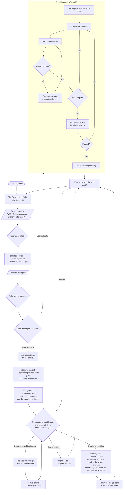

# Agent Flow

The agent is **The Brain** — a single [Deep Agent](https://docs.langchain.com/oss/javascript/deepagents/overview) that speaks in persona and guides the user (always addressed as *Pinky*) through a deliberate journey: pick a topic, pick a subtopic, then either learn it or have an article written about it.

Everything lives in `src/agents/`.

## Architecture at a glance

The previous release routed a supervisor node to four hand-written specialist nodes. That is gone. There is now **one agent**, built with `createDeepAgent`, whose behaviour comes from two things:

| Piece | File | Responsibility |
| --- | --- | --- |
| Persona | `src/agents/persona.ts` | Who The Brain is — voice, catchphrases, and the rule that facts always outrank theatrics. |
| Journey | `src/agents/prompts.ts` | The conversation state machine and the teaching loop. |
| Tools | `src/agents/tools.ts` | Everything factual: topics, subtopics, [retrieval](./retrieval), article files. |
| Assembly | `src/agents/agent.ts` | Binds model + tools + prompt + checkpointer. |
| Compatibility | `src/agents/graph.ts` | `runGraphWorkflow()` — the unchanged entry point for CLI, REST, MCP and ACP. |

The division of labour is the important part: **the model owns the conversation, the tools own the truth.** Topics and subtopics are never invented — they are read from the knowledge store.

## The user journey



The loop never dead-ends: both branches return to *"what next?"*, which returns to the topic menu.

## Tools

| Tool | Purpose |
| --- | --- |
| `list_topics` | The topics of expertise, filtered to those actually present in the store. |
| `list_subtopics` | Subtopics for a topic, derived from the stored material. |
| `retrieve_content` | Source passages for a subtopic — grounds every explanation and article. |
| `save_article` | Writes markdown to `./articles/` and returns the absolute path. |
| `update_article` | Overwrites an existing article, after Pinky confirms. |
| `read_article` | Reads a saved article back before revising it. |
| `publish_article` | Renders the article's layout, generates its images, and drafts it on the blog through that site's own `articles` MCP server. |
| `export_article` | Copies a finished article into a folder Pinky names. |

## How an article gets written

Composition is entirely prompt-driven — there is no article-generating function to read.
Three pieces of the system prompt do the work, assembled in `src/agents/prompts.ts`:

```
BRAIN_SYSTEM_PROMPT
  = BRAIN_PERSONA_PROMPT   (persona.ts)     — the voice
  + ARTICLE_CRAFT_PROMPT   (prompts.ts)     — the writing standard
  + JOURNEY_PROMPT         (prompts.ts)     — the conversation's state machine
```

For a single article the sequence is:

1. **Ask for instructions.** Step 4a asks Pinky for length, tone and focus, and waits.
2. **Retrieve the material.** `retrieve_content` returns passages from the knowledge store.
   The model is instructed to write only from these — if retrieval returns nothing useful it
   must say so rather than invent material.
3. **Compose against the standard.** `ARTICLE_CRAFT_PROMPT` governs the prose: fix topic,
   audience, purpose and stakes before drafting; three-part structure; one idea per
   paragraph with explicit links; varied sentences; supported claims; a short title.
   Pinky's own instructions outrank the standard where the two disagree.
4. **Lay it out in the file.** The same standard governs the article's shape: an `###` deck
   under the title, `:::note|tip|warn` callouts, and `` figures. The
   layout lives in the markdown so that what Pinky reviews is the real shape of the post,
   not a description of one.
5. **Sign it.** The file ends with a fixed credit line naming The Brain and linking back to
   this repository. It is in the file for the same reason the layout is — the article Pinky
   reviews is the signed article — and its wording is verbatim rather than composed per
   piece, because a signature that varies is not a signature.
6. **Save and offer delivery in one breath.** `save_article` writes `./articles/<slug>.md`, and
   the same turn reports the path, describes the layout, and presents the delivery menu. There
   is deliberately no "anything to change?" pause: a revision request simply arrives in place of
   a destination, and revisions still go through `update_article`, only after Pinky confirms the
   change.
7. **Deliver.** Step 4c offers the blog, a folder, or neither. Choosing the blog publishes
   immediately — The Brain writes the listing description and tags itself and reports what it
   used, rather than asking for them and then asking again whether to push.

Note what is *not* code: nothing enforces the structure, the length or the title cap. They
are instructions the model follows, which is why the wording is precise and why the
regression tests in `src/tests/unit/publishing.test.ts` assert on the prompt text itself.

### Adding more detailed instructions about article creation

There are four places to put article guidance, and picking the right one matters:

| Where | For | Applies to |
| --- | --- | --- |
| `ARTICLE_CRAFT_PROMPT` (`src/agents/prompts.ts`) | Durable rules about how articles should read | Every article, always |
| `JOURNEY_PROMPT` Step 4a/4c (`src/agents/prompts.ts`) | Changes to the *process* — what to ask, in what order, what to report | Every article, always |
| Tool `description` / schema `.describe()` (`src/agents/tools.ts`) | Rules about a specific argument | Whenever that tool is called |
| Pinky's answer at Step 4a | One-off requests: length, tone, focus | That article only |

Most changes belong in `ARTICLE_CRAFT_PROMPT`. It is deliberately a standalone export so
that refining how articles read never means editing the conversation's state machine.

The long-form version of that standard, with the reasoning and sources behind each rule,
is the [Article Writing Guide](./article-writing-guide) — **edit both together**, and add a
test asserting the new rule reaches `BRAIN_SYSTEM_PROMPT` so it cannot be silently dropped.

### Adding instructions about the illustrations

Image guidance has its own four places, and only the first of them is written by the model:

| Where | For | Model-visible? |
| --- | --- | --- |
| `ARTICLE_CRAFT_PROMPT` → **Figures** (`src/agents/prompts.ts`) | *What to depict, and when a figure earns its place* — how many, where they sit, concept rather than labelled diagram | Yes — The Brain writes the `image:` prompt |
| `buildImagePrompt` / `buildFigurePrompt` (`src/utils/image-gen.ts`) | House rules true of every image whatever it shows: the no-text clause, the full-bleed composition clause, the article's style | No — appended after the author's words |
| `ILLUSTRATION_STYLES` / `styleFor` (`src/utils/illustration-styles.ts`) | The look itself — the catalogue of styles, and the rule that fixes one per article | No |
| `imageConfig` in the generator (`src/utils/image-gen.ts`) | Geometry: aspect ratio and pixel size | No |

The dividing line is what varies. Anything that differs **per figure** is a prompt rule in
`prompts.ts`, because only the model knows what a given passage needs a picture of. Anything
true of **every** image is code in `image-gen.ts`, where it cannot be forgotten — the no-text
clause is the canonical case, repeated verbatim in both builders rather than trusted to the
model, because image models render lettering eagerly and get it subtly wrong.

Geometry is the one thing that should never be phrased as prose. `aspectRatio` and
`imageSize` are parameters on the request and are honoured; a sentence asking for a square
is a suggestion. Note that a size the API rejects would cost the picture silently — every
failure in this module is soft — so `generateImage` retries once at `1K` before giving up.

Style is deliberately **not** the model's to choose. `styleFor` hashes the article title to
one of the ten entries in `ILLUSTRATION_STYLES`, and that single style is handed to the
cover and to every figure of that article. Deterministic, so republishing an article under
review does not quietly redraw it; per-article, so a post reads as one set of pictures while
two different posts do not look alike. `buildFigurePrompt` takes the style as a required
argument for that reason — a figure has no identity of its own to derive one from.

### How subtopics are derived

The ingested areas are not shaped alike, so `extractSubtopics` adapts:

- **Interview roadmaps** store `Role: X - Topic: Y` lines, so the distinct **roles** (React Developer, Node.js Developer, …) are the useful grouping.
- **The other areas** are markdown, so **headings** are the natural subtopics. Top-level headings are preferred; for shallow areas (the English material has only two `#` headings) `##` headings are included as well.

### Retrieval

`retrieve_content` returns the passages most likely to answer a query within one area, fusing **BM25** with **vector similarity** over `src/storage/knowledge-store.json`. Each passage arrives labelled with the document and section it came from, so a claim can be attributed rather than asserted.

Retrieval never depends on a key: without `GEMINI_API_KEY`, without an embeddings file, or after a failed embedding call, it degrades to BM25 alone.

This used to be substring counting — and replacing it moved recall@10 from 0.597 to 0.900 on a labelled query set, with the number of questions that returned nothing useful going from four in twenty to none. See **[Retrieval (RAG)](./retrieval)** for the retriever, the measurements, and where to change any of it.

## Model

`createChatModel` (`src/utils/model.ts`) returns **Anthropic Claude**, defaulting to `claude-sonnet-5` and overridable via `ANTHROPIC_MODEL`. Anthropic is the only supported provider: without `ANTHROPIC_API_KEY` the factory throws rather than falling back to another provider.

No `temperature` is sent — Claude Sonnet 5 rejects the parameter (`temperature is deprecated for this model`), so the model's own default applies.

## State and memory

Each turn is one call to `runGraphWorkflow(agentName, prompt, threadId, progressCallback)`. Conversation state persists through the existing `SQLiteCheckpointer`, keyed by `thread_id` — that is what lets the journey span many turns while the agent remembers the chosen topic, the subtopic, and the article in progress.

Two details worth knowing:

- **The agent is built lazily.** Constructing it needs an API key, so `getGraph()` defers creation until the first run; importing the module never throws. The exported `graph` is a proxy over that lazy instance, which is what LangGraph Studio (`langgraph.json`) resolves.
- **`instructorState.explanation` holds only the latest reply.** Because the checkpointer accumulates the whole thread, returning every AI message would replay the entire conversation on each turn. The entry points read this field directly.

## Design notes

**Why no subagents?** Deep Agents can delegate to subagents with isolated context. Both of our modes — teaching and article writing — are *multi-turn conversations with the user*, and a subagent's isolated, one-shot context cannot hold a dialogue. So both live in the main agent as prompt-driven modes.

**Why is the built-in prompt removed?** `createDeepAgent` ships a base prompt for a task-executing coding agent. This agent is a persona-driven conversational guide, and the two sets of instructions compete for the model's attention, so `agent.ts` sets `base: null` and supplies its own. The planning and virtual-filesystem tools remain available.
