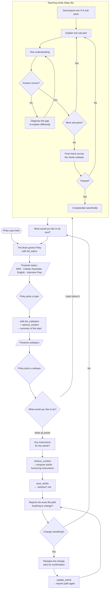

# Agent Flow

The agent is **The Brain** — a single [Deep Agent](https://docs.langchain.com/oss/javascript/deepagents/overview) that speaks in persona and guides the user (always addressed as *Pinky*) through a deliberate journey: pick a topic, pick a subtopic, then either learn it or have an article written about it.

Everything lives in `src/agents/`.

## Architecture at a glance

The previous release routed a supervisor node to four hand-written specialist nodes. That is gone. There is now **one agent**, built with `createDeepAgent`, whose behaviour comes from two things:

| Piece | File | Responsibility |
| --- | --- | --- |
| Persona | `src/agents/persona.ts` | Who The Brain is — voice, catchphrases, and the rule that facts always outrank theatrics. |
| Journey | `src/agents/prompts.ts` | The conversation state machine and the teaching loop. |
| Tools | `src/agents/tools.ts` | Everything factual: topics, subtopics, retrieval, article files. |
| Assembly | `src/agents/agent.ts` | Binds model + tools + prompt + checkpointer. |
| Compatibility | `src/agents/graph.ts` | `runGraphWorkflow()` — the unchanged entry point for CLI, REST, MCP and ACP. |

The division of labour is the important part: **the model owns the conversation, the tools own the truth.** Topics and subtopics are never invented — they are read from the knowledge store.

## The user journey

The loop never dead-ends: both branches return to *"what next?"*, which returns to the topic menu.

## Tools

| Tool | Purpose |
| --- | --- |
| `list_topics` | The topics of expertise, filtered to those actually present in the store. |
| `list_subtopics` | Subtopics for a topic, derived from the stored material. |
| `retrieve_content` | Source passages for a subtopic — grounds every explanation and article. |
| `save_article` | Writes markdown to `./articles/` and returns the absolute path. |
| `update_article` | Overwrites an existing article, after Pinky confirms. |
| `read_article` | Reads a saved article back before revising it. |

### How subtopics are derived

The ingested areas are not shaped alike, so `extractSubtopics` adapts:

- **Interview roadmaps** store `Role: X - Topic: Y` lines, so the distinct **roles** (React Developer, Node.js Developer, …) are the useful grouping.
- **The other areas** are markdown, so **headings** are the natural subtopics. Top-level headings are preferred; for shallow areas (the English material has only two `#` headings) `##` headings are included as well.

### Retrieval

`retrieve_content` scores chunks in an area by how many query terms they contain and returns the top matches. Despite the filename, `src/storage/vector-store.json` holds **no vectors** — this is keyword overlap, not embeddings, and it is carried over unchanged from the previous implementation.

## Model

`createChatModel` (`src/utils/model.ts`) returns **Anthropic Claude**, defaulting to `claude-sonnet-5` and overridable via `ANTHROPIC_MODEL`. Anthropic is the only supported provider: without `ANTHROPIC_API_KEY` the factory throws rather than falling back to another provider.

No `temperature` is sent — Claude Sonnet 5 rejects the parameter (`temperature is deprecated for this model`), so the model's own default applies.

## State and memory

Each turn is one call to `runGraphWorkflow(agentName, prompt, threadId, progressCallback)`. Conversation state persists through the existing `SQLiteCheckpointer`, keyed by `thread_id` — that is what lets the journey span many turns while the agent remembers the chosen topic, the subtopic, and the article in progress.

Two details worth knowing:

- **The agent is built lazily.** Constructing it needs an API key, so `getGraph()` defers creation until the first run; importing the module never throws. The exported `graph` is a proxy over that lazy instance, which is what LangGraph Studio (`langgraph.json`) resolves.
- **`instructorState.explanation` holds only the latest reply.** Because the checkpointer accumulates the whole thread, returning every AI message would replay the entire conversation on each turn. The entry points read this field directly.

## Design notes

**Why no subagents?** Deep Agents can delegate to subagents with isolated context. Both of our modes — teaching and article writing — are *multi-turn conversations with the user*, and a subagent's isolated, one-shot context cannot hold a dialogue. So both live in the main agent as prompt-driven modes.

**Why is the built-in prompt removed?** `createDeepAgent` ships a base prompt for a task-executing coding agent. This agent is a persona-driven conversational guide, and the two sets of instructions compete for the model's attention, so `agent.ts` sets `base: null` and supplies its own. The planning and virtual-filesystem tools remain available.
