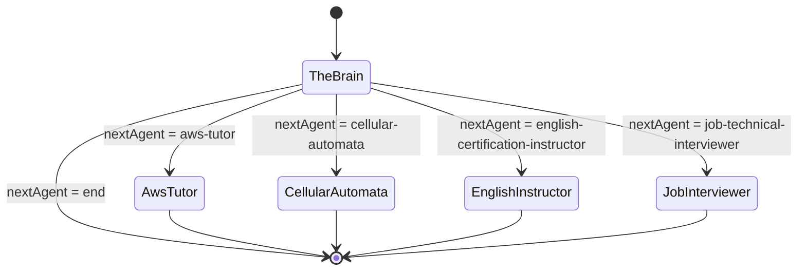
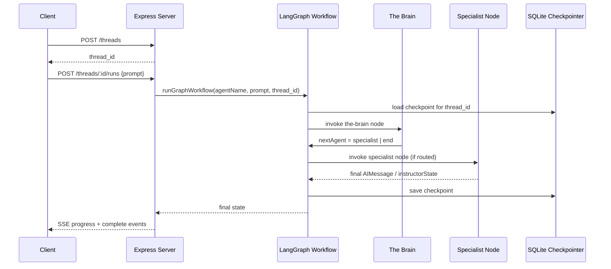

# Architecture

## Agent graph & specialized workers

At the core of the service is a cyclic LangGraph.js execution graph (`src/agents/graph.ts`)
compiling two kinds of nodes:

- **The Brain** (`src/agents/the-brain.ts`) - the central routing and supervisor agent.
  It detects the task domain of the last human message (via keyword matching in
  `detectArea()`, no LLM call required for detection) and either:
  - routes to a specialist node, generating a one-line persona-rich routing
    announcement using an LLM (or a static fallback line if no LLM key is configured),
    or
  - responds directly (`nextAgent: "end"`), explaining that no specialist matched and
    listing the available specialist areas.
- **Specialists** (`src/agents/specialists.ts`) - a single shared
  `runSpecialistNode()` implementation reused by four graph nodes (`aws-tutor`,
  `cellular-automata`, `english-certification-instructor`,
  `job-technical-interviewer`). Each looks up relevant chunks from the pre-compiled
  vector store (`src/storage/vector-store.json`) via simple keyword-overlap scoring in
  `retrieveContext()`, then asks an LLM to answer using that context (or returns a mock
  lesson/quiz if no LLM key is configured).

## Graph shape

The entry point is always `the-brain`. Every specialist node transitions unconditionally
to `__end__` after producing its response - there is currently no multi-hop routing
between specialists.

## Shared state (`AgentWorkspaceState`)

Defined in `src/agents/types.ts`:

- `messages`: the LangChain message history (reducer concatenates new messages).
- `nextAgent`: which node should run next (`"the-brain" | "aws-tutor" |
  "cellular-automata" | "english-certification-instructor" |
  "job-technical-interviewer" | "end"`).
- `routingStack`: reserved for future multi-hop routing history.
- `brainIntroduction`: the persona-rich routing line generated by The Brain, prefixed
  onto the specialist's final answer.
- `brainState`: reserved fields for future interactive/quiz modes
  (`selectedArea`, `interactionMode`, `activeQuiz`).
- `instructorState`: backward-compatible output shape (`userQuestion`, `explanation`,
  `suggestedTopics`) consumed by every entrypoint's response formatting.

## Persistence layer

- **`SQLiteCheckpointer`** (`src/storage/sqlite.ts`) extends LangGraph's
  `BaseCheckpointSaver` to persist thread history locally inside `state.db`. It applies
  `PRAGMA journal_mode = WAL`, `synchronous = OFF`, and `temp_store = MEMORY` for
  performance, and creates the database directory if it does not already exist. This
  checkpointer is used by every entrypoint, in every environment.
- **`S3Wrapper`** (`src/storage/s3.ts`) is used by higher-level cloud state storage. It
  auto-detects AWS credentials (or the ECS-injected container credentials env var) and
  transparently falls back to an in-memory `Map` when none are present, so local
  development never requires AWS access.
- **Vector store** (`src/storage/vector-store.json`) is a pre-compiled, paragraph-level
  chunk database (~1.7MB) generated by `src/scripts/ingest.ts`, tagged by specialist
  `area`, and loaded lazily/cached in memory by `src/agents/specialists.ts`.

## Data flow (REST example)

For the LLM provider selection used inside both `the-brain.ts` and `specialists.ts`,
see `createChatModel()` in [Source Code Reference](/docs/developer/source-code-reference#utils-srcutils).
