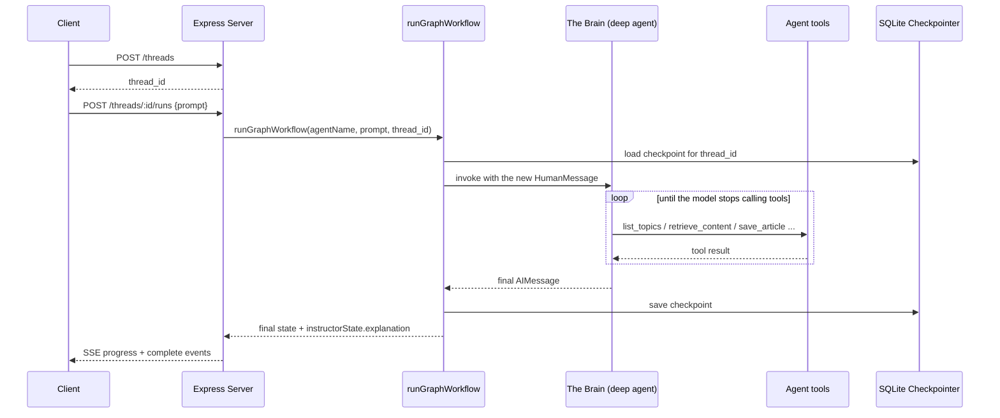

# Architecture

## The agent

At the core of the service is **The Brain**: a single [Deep Agent](https://docs.langchain.com/oss/javascript/deepagents/overview)
built with `createDeepAgent` (`src/agents/agent.ts`), which returns a compiled LangGraph
graph. It replaces the supervisor-plus-specialists graph of earlier releases — instead of
routing between four hand-written nodes, one persona-driven agent guides the user through
a topic, and either teaches it or writes an article about it.

- **Persona and journey** (`src/agents/persona.ts`, `src/agents/prompts.ts`) define who
  The Brain is and the conversation's state machine.
- **Tools** (`src/agents/tools.ts`) supply everything factual: `list_topics`,
  `list_subtopics`, `retrieve_content` (keyword-overlap scoring over
  `src/storage/vector-store.json`), and the article file tools.

See [Agent Flow](/docs/developer/agent-flow) for the journey diagram and the design
rationale.

## State

Defined in `src/agents/types.ts`:

- `messages`: the LangChain message history for the thread.
- `todos` / `files`: the Deep Agents planning and virtual-filesystem state.
- `instructorState`: backward-compatible output shape (`userQuestion`, `explanation`)
  consumed by every entrypoint's response formatting. `explanation` carries only the
  latest reply, since the checkpointer accumulates the full thread.

`runGraphWorkflow()` in `src/agents/graph.ts` keeps its original signature, so the CLI,
REST, MCP and ACP entrypoints are unaffected by the agent's internals.

## Persistence layer

- **`SQLiteCheckpointer`** (`src/storage/sqlite.ts`) extends LangGraph's
  `BaseCheckpointSaver` to persist thread history locally inside `state.db`. It applies
  `PRAGMA journal_mode = WAL`, `synchronous = OFF`, and `temp_store = MEMORY` for
  performance, and creates the database directory if it does not already exist. This
  checkpointer is used by every entrypoint, in every environment.
- **`S3Wrapper`** (`src/storage/s3.ts`) is used by higher-level cloud state storage. It
  auto-detects AWS credentials (or the ECS-injected container credentials env var) and
  transparently falls back to an in-memory `Map` when none are present, so local
  development never requires AWS access.
- **Vector store** (`src/storage/vector-store.json`) is a pre-compiled, paragraph-level
  chunk database (~1.7MB) generated by `src/scripts/ingest.ts`, tagged by `area`, and
  loaded lazily/cached in memory by `src/agents/tools.ts`. Despite the name it holds no
  embeddings; retrieval is keyword overlap.

## Data flow (REST example)

For LLM provider selection, see `createChatModel()` in
[Source Code Reference](/docs/developer/source-code-reference#utils-srcutils).
