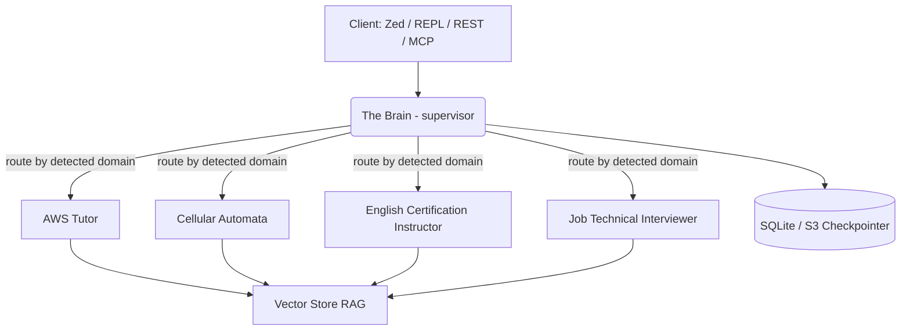

# Introduction

**Pinky and the Brain Agents Service** is a production-ready, cloud-native agent
service deployed on AWS, orchestrated via **LangGraph.js**, and exposed through the
**Agent Client Protocol (ACP)** standard for IDE integration (like the Zed Editor), a
REST/SSE API, and the **Model Context Protocol (MCP)**.

## Features

- **Cloud Architecture** - deployed on AWS ECS via Terraform, packaged inside Docker
  containers, and fronted by a CloudFront CDN.
- **Multi-Agent Orchestration** - a cyclic LangGraph.js execution graph routes queries
  through a supervisor ("The Brain") to specialist Retrieval-Augmented Generation (RAG)
  agents.
- **Durable Persistence** - a custom SQLite checkpointer (WAL mode) for local state, with
  an S3-backed wrapper for cloud environments.
- **Multiple Entrypoints** - stdin/stdout ACP, an interactive REPL CLI, an Express
  REST API with Server-Sent Events (SSE) streaming, and an MCP server.

## Architecture Overview

See [Architecture](/docs/developer/architecture) for a deeper look at the LangGraph
state machine and its persistence layer.

## Where to go next

- New to the service? Start with [Installation](/docs/end-user/installation) and
  [Configuration](/docs/end-user/configuration).
- Want to run it day-to-day? See [CLI Usage](/docs/end-user/cli-usage),
  [REST/SSE Server Usage](/docs/end-user/server-usage), [MCP Usage](/docs/end-user/mcp-usage),
  or [ACP & Zed Bridge Usage](/docs/end-user/acp-usage).
- Hit a snag? Check the [FAQ](/docs/end-user/faq) and
  [Troubleshooting](/docs/end-user/troubleshooting) guides.
- Contributing or extending the service? Read the
  [Project Structure](/docs/developer/project-structure),
  [Architecture](/docs/developer/architecture),
  [Source Code Reference](/docs/developer/source-code-reference), and
  [Infrastructure](/docs/developer/infrastructure) pages.
