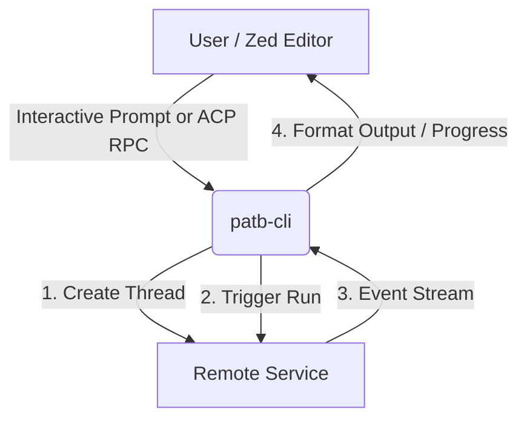

# Pinky and the Brain Agents Service

A production-ready, cloud-native agent service deployed on AWS, orchestrated via LangGraph.js, and exposed as a service through the Agent Client Protocol (ACP) standard for IDE integration (like Zed IDE) or REST/WebSocket clients.

---

## Project Overview & Recent Changes

The service has been upgraded from a local React/Ink CLI wrapper to a robust, cloud-ready backend system. 

### Key Improvements:
- **Cloud Architecture**: Deployed on AWS ECS / App Runner via Terraform, packaged inside Docker containers.
- **Robust Orchestration**: Powered by a cyclic LangGraph.js execution graph.
- **Local SQLite Checkpointing**: Thread states and checkpoints are saved locally via a custom SQLite checkpointer optimized for performance (using WAL mode).
- **RAG Context Integration**: Integrates a pre-compiled vector store of curated knowledge (~1.7MB).
- **Multiple Entrypoints**: Exposes Stdin/Stdout ACP, a REPL CLI, an Express REST API with Server-Sent Events (SSE) streaming support, and a Model Context Protocol (MCP) server.

---

## Core Architecture

### 1. Agent Graph & Specialized Workers
At the core of the service is a cyclic LangGraph.js execution graph compiling two main components:
*   **The Brain (`src/agents/the-brain.ts`)**: The central routing and supervisor agent. It detects task domains (using LLM analysis and keywords) and routes queries to specialist nodes. It formats responses with a custom character roleplay dialogue (The Brain interacting with Pinky) and follows up with structured system instructions.
*   **Specialists (`src/agents/specialists.ts`)**: The core Retrieval-Augmented Generation (RAG) agent. It matches queries against the vector store database to retrieve information on:
    *   **AWS Tutor**: Prep materials for the AWS Certified Cloud Practitioner (CLF-C02) exam.
    *   **Cellular Automata**: Rules and specifications of Conway's Game of Life, Lenia, and cellular automata.
    *   **English Certification Instructor**: Coaching for IELTS, TOEFL, and Cambridge exams.
    *   **Job Technical Interviewer**: Roadmaps and mock interview questions for frontend/backend software engineering roles.

### 2. State & Storage Persistence
*   **SQLite Checkpointer (`src/storage/sqlite.ts`)**: Extends LangGraph's `BaseCheckpointSaver` to persist thread history locally inside `state.db`. Optimized using SQL PRAGMAs (`WAL`, `synchronous=OFF`, `temp_store=MEMORY`).
*   **AWS S3 Storage (`src/storage/s3.ts`)**: Used to persist state in cloud environments, with an automatic local in-memory fallback for offline/local development.
*   **Vector DB (`src/storage/vector-store.json`)**: Pre-compiled database with embedded source documents.

---

## Directory Structure

```
pinky-and-the-brain/
├── docs/                               # Architecture and Specifications records
├── terraform/                          # AWS Cloud IaC Configurations
│   ├── main.tf                         # ECR, ECS Cluster, ECS Express Gateway Service, DynamoDB, S3, IAM
│   ├── variables.tf                    # Deployment settings & regional variables
│   └── outputs.tf                      # AWS CloudRunner service endpoints
├── src/
│   ├── index.ts                        # Main readline CLI (ACP Stdin/Stdout Entrypoint)
│   ├── cli.ts                          # Standalone interactive REPL CLI for local testing
│   ├── server.ts                       # Express REST API (HTTP, SSE Streaming, Slack/Teams webhooks)
│   ├── mcp.ts                          # Model Context Protocol (MCP) server
│   ├── graph-sdk.ts                    # SDK exports for modular reuse of the graph engine
│   ├── config.ts                       # Configuration parser & Zod schema validator
│   ├── agents/                         # Agent Graph & Definitions
│   │   ├── types.ts                    # Graph workspace shared state schema
│   │   ├── graph.ts                    # LangGraph orchestration compilation
│   │   ├── the-brain.ts                # Central router, supervisor, and roleplay agent
│   │   └── specialists.ts              # Core RAG retrieval node
│   ├── protocol/                       # ACP JSON-RPC standard parsing
│   │   ├── acp-server.ts               # ACP Protocol handler
│   │   └── messages.ts                 # Validation schemas (Zod)
│   ├── storage/                        # State persistence
│   │   ├── sqlite.ts                   # SQLiteCheckpointer extending LangGraph's BaseCheckpointSaver
│   │   ├── s3.ts                       # S3 Storage client wrapper (with offline local fallback)
│   │   └── vector-store.json           # Pre-compiled vector database
│   └── utils/                          # Shared utilities
│       ├── logger.ts                   # Centralized console and file logger (agent.log & stderr)
│       ├── messages.ts                 # Message helper functions
│       └── model.ts                    # LLM factory (OpenAI and Google Gemini switcher)
├── scripts/                            # Deploy & operations scripts
│   ├── deploy.js                       # Deploy orchestration script (Docker build, ECR push, Terraform run)
│   ├── report-infra.ps1                # PowerShell script for AWS infrastructure status audits
│   ├── tail-logs.js                    # Script to stream cloud container logs
│   └── test-tracing.js                 # Script to verify LangSmith tracing connection
├── package.json                        # Scripts & dependencies
├── tsconfig.json                       # TS compilation config
└── vitest.config.ts                    # Test runner config
```

---

## Getting Started

### Prerequisites

- **Node.js**: `v20.x` or higher
- **npm**: `v10.x` or higher

### Setup & Installation

1. Clone the repository and navigate into the project directory:
   ```bash
   cd pinky-and-the-brain
   ```

2. Install dependencies:
   ```bash
   npm install
   ```

3. Create a `.env` file in the root directory:
   ```env
   # LLM API Keys (At least one is required)
   GOOGLE_API_KEY=your_gemini_api_key_here
   OPENAI_API_KEY=your_openai_api_key_here

   # API Gateway security key (Required for server and clients)
   PATBA_API_KEY=your_secret_api_key_here

   # Local Storage
   SQLITE_DB_PATH=state.db
   PORT=8080

   # AWS Configuration (Optional, falls back to local sqlite/memory offline)
   AWS_REGION=sa-east-1
   S3_BUCKET_NAME=pinky-and-the-brain-agents-state-store

   # Optional integrations
   SLACK_BOT_TOKEN=your_slack_bot_token_here
   ```

### Building the Project

Compile TypeScript into JavaScript:
```bash
npm run build
```

---

## Running the Service Locally

You can execute the service locally under different operational interfaces:

### 1. Standalone Interactive REPL CLI
Run the local agent directly in your command line:
```bash
npm run cli
```

### 2. HTTP & SSE REST Server
Start the Express API gateway to listen for HTTP requests and stream progress via Server-Sent Events (SSE) (defaults to port `8080`):
```bash
npm run server
```

### 3. Model Context Protocol (MCP) Server
Run the stdio-based MCP server to expose the agent to MCP clients (like Claude Desktop):
```bash
npm run mcp
```

### 4. Stdin/Stdout ACP Server
Run the raw Agent Client Protocol (ACP) JSON-RPC stdin/stdout server:
```bash
npm run start
```
To initialize a handshake, write this payload to `stdin`:
```json
{"jsonrpc": "2.0", "id": 1, "method": "initialize", "params": {"protocolVersion": "2026-06-24", "capabilities": {}, "clientInfo": {"name": "test"}}}
```

---

## Running Tests

Run the test suite using Vitest:

```bash
# Run unit tests
npm run test:unit

# Run integration tests
npm run test:integration
```

---

## The CLI Tool Project (`patb-cli`)

For production setups or when you want to connect to a remote server without running the full agent orchestrator locally, you should use the **Pinky and the Brain CLI (`patb-cli`)**.

`patb-cli` acts as a lightweight wrapper client and gateway that communicates with the cloud-hosted AWS agent service (located at `d33ib4uu7f4xpi.cloudfront.net` or any custom local/remote URL).



### 1. Installation

#### Via NPM (Recommended)
You can run it directly using `npx` or install it globally:
```bash
npm install -g @thiagocolen/patb-cli
```

#### From Local Source
Navigate to the `patb-cli` project directory and build it:
```bash
cd D:/_code-projects/patb-cli
npm install
npm run build
npm link # optional, links 'patb-cli' command globally
```

### 2. Configuration (API Key)

The CLI requires `PATBA_API_KEY` to authenticate requests with the remote service. Configure this key using one of the following methods:

*   **Local `.env` File**: Create a `.env` file in the folder where you run the CLI:
    ```env
    PATBA_API_KEY=your_secret_api_key_here
    ```
*   **Environment Variables**:
    *   *Windows (PowerShell)*: `$env:PATBA_API_KEY="your_secret_api_key_here"`
    *   *macOS/Linux*: `export PATBA_API_KEY="your_secret_api_key_here"`

### 3. CLI Usage

*   **Interactive REPL Mode (default)**: Starts a chat session with the remote agent.
    ```bash
    patb-cli
    # or if running from local source folder
    node dist/index.js
    ```
*   **Zed ACP Bridge Mode**: Starts the server in bridge mode, speaking JSON-RPC over `stdin`/`stdout`.
    ```bash
    patb-cli --bridge
    # or
    node dist/index.js --bridge
    ```

---

## Integrating with Zed Editor

You can configure Zed to use `patb-cli` as an external agent server.

### Method 1: Using `npx` (Recommended - Zero Installation)
This is the cleanest approach because you do not need to install the package globally or clone/compile any files locally. Zed will fetch and execute the package on demand.

1. Open your Zed configuration file (`Ctrl+Shift+P` or `Cmd+Shift+P` -> `zed: open settings`).
2. Add the custom agent server under the `agent_servers` block:

```json
{
  "agent_servers": {
    "patb-agent": {
      "type": "custom",
      "command": "npx",
      "args": ["-y", "@thiagocolen/patb-cli", "--bridge"],
      "env": {
        "PATBA_API_KEY": "your_secret_api_key_here"
      }
    }
  }
}
```

### Method 2: Using the Local Source Build
If you prefer to compile the CLI codebase locally:

1. Open your Zed configuration file.
2. Register the path to your compiled `dist/index.js` file:

```json
{
  "agent_servers": {
    "patb-agent": {
      "type": "custom",
      "command": "node",
      "args": [
        "D:/_code-projects/patb-cli/dist/index.js",
        "--bridge"
      ],
      "env": {
        "PATBA_API_KEY": "your_secret_api_key_here"
      }
    }
  }
}
```
*(Make sure to use absolute paths with forward slashes `/`, even on Windows)*.

### Step 3: Trigger the Agent in Zed
1. Open the **Agent Panel** in Zed (using the ✨ icon or shortcut `Cmd+?` / `Ctrl+?`).
2. Open the thread settings dropdown.
3. Select `patb-agent` as your active agent.
4. Prompt the agent (e.g., `"Design a layout for a RAG search service"`) and watch the streaming progress updates and responses!
